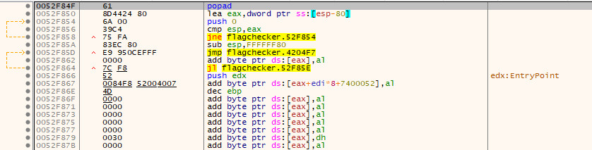

# FlagChecker
# Analysis
#### CFF Explorer
Trước hết mình load file vào CFF Explorer


=> File thuộc định dang PE32 và được pack bằng UDX v3.0 

=> Tắt ASLR (Address space layout randomization - một kĩ thuật phòng thủ bằng cách ngẫu nhiên hóa địa chỉ bộ nhớ của các tiến trình, cố gắng ngăn chặn việc tấn công thông qua vị trí của các applications memory map)
#### Find OEP with x32dbg
Load file vào x32dbg, sau đó nhấn ```F9``` để nhảy tới ep của chương trình


Nhận thấy lệnh đầu tiên được thực thi là lệnh ```PUSHAD```. Lệnh này nhằm mục đích bảo toàn các thanh ghi, nó sẽ thực hiện lưu toàn bộ giá trị khởi tạo 
của tất cả các thành ghi vào stack, sau đó thực hiện unpack routine, cuối cùng trước khi nhảy tới OEP, 
packer sẽ thực hiện việc khôi phục lại giá trị của các thanh ghi đã lưu trên stack bằng lệnh ```POPAD```.

=> Như vậy mình sẽ tìm kiếm lệnh ```popad```


Trace tới lệnh này thì xuất hiện  1 vòng lặp vô hạn và khi trace qua lệnh ```jne``` nó luôn bỏ qua lệnh ```jmp``` ngay phía dưới nó và dường như lệnh này không bao giờ được thực hiện

=> lệnh ```jmp``` khả năng nhảy tới oep cần tìm



=> Đặt bp, run và nhấn ```F7``` trace vào lệnh ```jmp```


=> Tìm được oep của file packed
#### Dump file
Sử dụng Scylla tiến hành dump file 


=> Xóa invalid import, dump file sau đó fix dump lại file đã dump

Mở file đã dump vào IDA, ta thành công detect vào hàm WinMain 


```
int __stdcall WinMain(HINSTANCE hInstance, HINSTANCE hPrevInstance, LPSTR lpCmdLine, int nShowCmd)
{
  if ( !BYTE1(dword_4D13BC) )
    return 1;
  dword_4D135C = 0;
  dword_4D1350 = 0;
  ::hInstance = hInstance;
  dword_4D1390 = IsThemeActive();
  _set_new_handler(NewHandler);
  _set_new_mode(1);
  sub_403656();
  sub_40445D((wchar_t *)lpCmdLine);
  SystemParametersInfoW(0x2001u, 0, pvParam, 2u);
  return dword_4D135C;
}
```
##### Hàm sub_40445D


##### IsDebuggerPresent


Như vậy mình tiến hành rename cho ```loc_44370F``` thành ```being_debugged``` và tiến hành patch file

=> Chạy thử:


=> Chương trình yêu cầu nhập flag sau đó check flag mình nhập vào xem có đúng không


