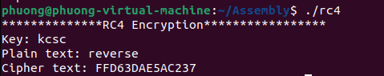

# RC4

Chall: Code thuật toán mã hóa RC4

Điều kiện: Assembly 32 bit, window hoặc linux

Yêu cầu: 

Chạy được

input nhập vào là chữ hoặc số hoặc mật khẩu muốn encrypt

Kết quả in ra theo dạng hex

Giải thích code rõ ràng

# Run



# Code

```
;a macro with two parameters
;implements the write system call
%macro write_string 2
    mov     ecx,%1      ;msg
    mov     edx,%2      ;length msg
    mov     eax,4       ;sys_write
    mov     ebx,1       ;stdout
    int     0x80        ;call kernel
%endmacro
;a macro with two parameters
;implements the read system call
%macro read_string 2
    mov     ecx,%1      ;msg
    mov     edx,%2      ;length msg
    mov     eax,3       ;sys_read
    mov     ebx,0       ;stdin
    int     0x80        ;call kernel
%endmacro

segment .data
    msg1    db "**************RC4 Encryption*****************",0xA
    lenmsg1  equ $ -msg1
    msg2    db "Key: ",0xA           ;key 
    msg3    db "Plain text: ",0xA    ;string/number/pass... want to encrypt
    newline db 0xA
    msg4    db "Cipher text: "   ;hex


segment .bss
    s 	resb 2

section .text
    global _start
  
_start:
    push    ebp                                     	;save ebp
	mov     ebp,esp                                 ;set ebp to esp
	sub     esp,3336                                ;set 3336 bytes for local variables
    
    write_string    msg1,lenmsg1
    write_string    msg2,5
    lea             ebx,[ebp - 1024]	;key         
    read_string     ebx,1024
    
    strlen_key:
        mov byte [ebp-1025],0   ;len of key
		Loop_strlen_key:
            movzx       ecx,byte [ebp-1025]         ;i
            movzx       eax,byte [ebp+ecx-1024]     ;key[i]
            cmp         eax,0xA                     ;compare it with '\n' to count i
            je          KSA                         ;if equal, jump to KSA      
            inc         byte [ebp-1025]             ;i++
            jmp         Loop_strlen_key

    KSA:
        ;S box
        xor ecx,ecx
        Loop_Init:
            mov     byte [ebp+ecx-1281],cl
            inc     ecx
            cmp     ecx,256
            jne      Loop_Init
        
        mov byte [ebp-1282],0   ;j=0
        xor ecx,ecx ;i=0
        xor eax,eax
        Loop_KSA:
            mov         eax,ecx
            xor         edx,edx
            movzx       ebx,byte [ebp-1025]
            div         ebx
            movzx       eax,byte [ebp+edx-1024] ;key[i%len]
            
            xor         edx,edx
            movzx       edx,byte [ebp+ecx-1281] ;S[i]
            add         eax,edx

            xor         edx,edx
            movzx       edx,byte [ebp-1282] ;j
            add         eax,edx

            mov         ebx,256
            xor         edx,edx
            div         ebx
            mov         byte [ebp-1282],dl  ;j = (j + S[i] + key[i % len]) % N
            
            movzx   eax,byte [ebp+ecx-1281] ;S[i]
            movzx   ebx,byte [ebp+edx-1281] ;S[j]
            ;swap
            mov     byte [ebp+ecx-1281],bl
            mov     byte [ebp+edx-1281],al

            inc         ecx
            cmp         ecx,256
            jne         Loop_KSA

    PRGA:       
        write_string    msg3,12
        lea             ebx,[ebp - 2307]	;plaintext          
        read_string     ebx,1024

    strlen_plaintext:
        mov byte [ebp-2308],0   ;len of plaintext
		Loop_strlen_plaintext:
            movzx       ecx,byte [ebp-2308]         ;i
            movzx       eax,byte [ebp+ecx-2307]     ;plaintext[i]
            cmp         eax,0xA                     ;compare it with '\n' to count i
            je          Loop_PRGA                       
            inc         byte [ebp-2308]             ;i++
            jmp         Loop_strlen_plaintext

    Loop_PRGA:   
        write_string    msg4,13
        mov     byte [ebp-1282],0   ;i=0
        mov     byte [ebp-1283],0   ;j=0
        mov     byte [ebp-2309],0   ;n
        Loop:
            xor     eax,eax
            movzx   eax,byte [ebp-1282]
            add     eax,1
            mov     ebx,256
            xor     edx,edx 
            div     ebx
            mov     byte [ebp-1282],dl ;i = (i + 1) % N

            xor     eax,eax
            movzx   eax,byte [ebp-1283]
            movzx   ebx,byte [ebp+edx-1281]
            add     eax,ebx
            xor     ebx,ebx
            mov     ebx,256
            xor     edx,edx
            div     ebx
            mov     byte [ebp-1283],dl ;j = (j + S[i]) % N

            ;swap
            movzx   eax,byte [ebp+edx-1281] ;S[j]
            movzx   ecx,byte [ebp-1282]
            movzx   ebx,byte [ebp+ecx-1281] ;S[i]
            mov     byte [ebp+edx-1281],bl
            mov     byte [ebp+ecx-1281],al

            movzx   eax,byte [ebp+ecx-1281] ;S[i]
            movzx   ebx,byte [ebp+edx-1281] ;S[j]
            add     eax,ebx
            xor     ebx,ebx
            mov     ebx,256
            xor     edx,edx
            div     ebx
            movzx   eax,byte [ebp+edx-1281] ;S[(S[i] + S[j]) % N]

            movzx   ecx,byte [ebp-2309]
            movzx   ebx,byte [ebp+ecx-2307] ;plaintext[n]
            xor     eax,ebx
            mov     byte [ebp+ecx-3333],al ;ciphertext[n]

            inc     byte [ebp-2309]
            movzx   ecx,byte [ebp-2309]
            movzx   eax,byte [ebp-2308]
            cmp     ecx,eax
            jne     Loop

    mov     byte [ebp-3334],0   ;i  
    print_ciphertext:
        movzx   ecx,byte [ebp-3334]
        movzx   edx,byte [ebp-2308] ;len of plaintext
        cmp     ecx,edx
        je      exit     
        movzx   eax,byte [ebp+ecx-3333] ;ciphertext[i]
        call    dec_to_hex
        inc     byte [ebp-3334] ;i++
        jmp     print_ciphertext

    exit:
        write_string newline,1
        mov     eax,1   ;sys_exit
        int     0x80    ;call kernel   

    dec_to_hex:
        mov     ebx,16
        mov     ecx,2   ;2 digits
        mov     esi,s+1 ;point to last loc, store converted number
        back:
            xor     edx,edx
            div     ebx
            cmp     dl,0x9  ;hex consist of (0-9) and (A-F)
            jbe     add_30  ;if dl <= 9
            add     dl,0x7
            add_30:
            add     dl,0x30

            mov     [esi],dl
            dec     esi
            dec     ecx
            jnz     back
        write_string    s,2
        ret
```
