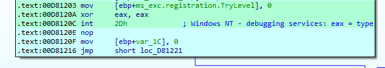

# AntiDebug_3

# Analysis with IDA
Ném file vào ida và phân tích 


Tại hàm main mình nhận thấy chương trình gọi tới hàm SetUnhandledExceptionFilter

Hàm này nhận đầu vào là một function xử lý lúc nhận được exception. Tức là khi chương trình khi không chạy bằng trình debugger, chương trình sẽ theo flow TopLevelExceptionFilter còn nếu chương trình đang bị debug thì sẽ theo flow bên dưới.

-> Về cơ bản đây là hàm chống chúng ta debug , khi bật thử debug thì chương trình dừng ngay tại địa chỉ 0x00D815EB cùng signal "không thể chia cho không":


Excetion không thể chia cho 0, vì ngay dòng lệnh 0x00D815CE đã có lệnh sub làm cho thanh ghi eax có giá trị là 0. Nên khi chia cho 0 sẽ xảy ra lỗi.

=> Vây nên chall này chúng ta sẽ tiếp tục đi phân phân tích luồng flow TopLevelExceptionFilter đã được setUp.

Vì khi debug IDA không thể tự xử lý exceptions nên mình bypass bằng cách set ip tới thẳng địa chỉ chủa hàm TopLevelExceptionFilter (0x00D814C0) 
để không thực thi lệnh div này. Rồi tiến hành phân tích hàm TopLevelExceptionFilter

### TopLevelExceptionFilter
Tại đây mình tiến hành các thao tác make code và create function, sau đó F5 để xem mã giả C của chương trình


```
v3 = NtCurrentPeb();
v4 = v3 != (struct _PEB *)0xFFFF4040 && ((int)v3[0x54].AtlThunkSListPtr & 0x70) != 0;
byte_D84083 = v4 ^ 0xCD;
byte_D84082 = v3->BeingDebugged ^ 0xAB;
```

Đầu tiên chương trình gắn giá trị cho byte_D84083 và byte_D84082 thông qua v3, v4. 
v4 check v3 đã đúng địa chỉ PEB hay chưa và check NtGlobalFlag xem có bị debug hay không


=> Nếu không bị debug thì v4 có giá trị là 0

=> byte_D84083 = 0xCD

Để bypass không bị debug thì v3->BeingDebugged return 0 => byte_D84082 = 0xAB

Mình rename lại cho dễ nhìn:


=> Chương trình yêu cầu nhập flag, dùng lệnh memcpy copy 100 ký tự của flag nhập vào sang biến unk_D84560 để tiến hành tính toán

=> Độ dài flag là 100

```
dword_D84114 = sub_D81400();
```
```
int sub_D81400()
{
  unsigned int v1; // [esp+4h] [ebp-8h]
  unsigned int i; // [esp+8h] [ebp-4h]

  v1 = (char *)sub_D813F0 - (char *)&loc_D81330 - 16;
  for ( i = 0; i < v1 && (*((unsigned __int8 *)&loc_D81330 + i) ^ 0x55) != 0x99; ++i )
    ;
  return v1 - i + 0xBEEF;
}
```

=> Trước hết dword_D84114 có giá trị chính là giá trị trả về của hàm sub_D81400. Ta thấy hàm sẽ check các byte bắt đầu từ địa chỉ loc_D81330 với 0xCC (0x99 ^ 0x55 = 0xCC), nếu có sẽ break khỏi vòng lặp return giá trị sai

Đây là kỹ thuật int 3. Câu lệnh int 3 lệnh này là lệnh ngắt để dừng chương trình lại tại điểm các bạn muốn. Tức là khi mình sử dụng trình debugger, mỗi khi mình set breakpoint thì opcode 0xCC sẽ được set tại vị trí đó.

=> Để không phát hiện debug, hàm sub_D81400 return giá trị 0xBEEF

=> dword_D84114 = 0xBEEF

Bên cạnh đó, mình chú ý tới v1, tại đây cũng thực hiện 1 số thao tác make code, create function 

#### Ký tự 0 - 16
```
  for ( i = 0; i < 17; ++i )
    flag[i] ^= 1u;
```
=> Xor flag[0:17] với 1
#### Hàm sub_D81460
```
sub_D81460((int)&unk_D84652);
```

Hàm này có tham số truyền vào bắt đầu từ ký tự thứ 18 của flag

```
int __cdecl sub_D81460(int a1)
{
  int i; // [esp+0h] [ebp-4h]

  sub_D81330(&a1);
  for ( i = 0; i < 9; ++i )
    *(_WORD *)(a1 + 2 * i) ^= BEEFh;
  return sub_D811D0(a1 + 19);
}
```
Hàm sub_D81330
```
_DWORD *__cdecl sub_D81330(_DWORD *a1)
{
  _DWORD *result; // eax
  int i; // [esp+Ch] [ebp-8h]
  int j; // [esp+10h] [ebp-4h]

  for ( i = 0; i < 8; ++i )
    *(_BYTE *)(*a1 + i) ^= ABh;
  *a1 += 9;
  for ( j = 0; j < 12; ++j )
    *(_BYTE *)(*a1 + j) = ((2 * *(_BYTE *)(*a1 + j)) | 1) ^ (j + CDh);
  result = a1;
  *a1 += 13;
  return result;
}
```
#### Ký tự 18-25
```
for ( i = 0; i < 8; ++i )
    *(_BYTE *)(*a1 + i) ^= ABh;
```
=> Xor flag[18:26] với 0xAB
```
*a1 += 9;
```
=> Tính toán từ ký tự 27 của flag
#### Ký tự 27-38
```
for ( j = 0; j < 12; ++j )
    *(_BYTE *)(*a1 + j) = ((2 * *(_BYTE *)(*a1 + j)) | 1) ^ (j + CDh);
  result = a1;
```
=> Tính toán flag[27:39]
```
*a1 += 13;
```
=> Tính toán từ ký tự 40 của flag
#### Ký tự 40-57
```
for ( i = 0; i < 9; ++i )
    *(_WORD *)(a1 + 2 * i) ^= BEEFh;
```
=> Tính toán flag[40:58]
```
return sub_D811D0(a1 + 19);
```
=> Tiếp tục tính toán từ ký tự 59 của flag
#### Hàm sub_D811D0
```
int __cdecl sub_D811D0(int a1)
{
  int i; // [esp+14h] [ebp-1Ch]

  __asm { int     2Dh; Windows NT - debugging services: eax = type }
  for ( i = 0; i < 5; ++i )
    *(_BYTE *)(i + a1) = (*(_BYTE *)(i + a1) << (8 - i + 1)) | (*(char *)(i + a1) >> (i - 1));
  __debugbreak();
  *(_DWORD *)&byte_D84658 ^= 0xEFC00CFE;
  sub_D81190(a1 + 11);
  return sub_D81100();
}
```
Tại đây xuất hiện kỹ thuật antidebug 



#### Int 2D


Như vậy mình sẽ phân tích theo luồng except màu xanh, bypass bằng cách sửa thành ```jmp     short loc_D81269```


Lúc này hàm sub_D811D0 được sửa lại thành:
```
int __cdecl sub_D811D0(int a1)
{
  int i; // [esp+10h] [ebp-20h]

  __asm { int     2Dh; Windows NT - debugging services: eax = type }
  for ( i = 0; i < 5; ++i )
    *(_BYTE *)(i + a1) = (*(_BYTE *)(i + a1) << (8 - i)) | (*(char *)(i + a1) >> i);
  __debugbreak();
  dword_D84658 ^= 0xEFC00CFE;
  sub_D81190(a1 + 11);
  return sub_D81100();
}
```
#### Ký tự 59-63
```
for ( i = 0; i < 5; ++i )
    *(_BYTE *)(i + a1) = (*(_BYTE *)(i + a1) << (8 - i)) | (*(char *)(i + a1) >> i);
```
Tính toán flag[59:64]

Tiếp theo xuất hiện kỹ thuật antidebug int 3


#### Int 3


Như vậy mình sẽ phân tích theo luồng except, bypass bằng cách set thành ```jmp     short loc_D812E1```


=> Khi đó, ta được:
```
 *(_DWORD *)(a1 + 6) ^= 0xC0FE1337;
```
#### Ký tự 65-68
Tiếp tục tính tóa từ ký tự 65 của flag. Hàm lấy 4 byte của flag thực hiện xor => flag[65:69] 
```
sub_D81190(a1 + 11);
```
=> Tiếp tục tính toán từ ký tự 70 của flag
#### Hàm sub_D81190 - Ký tự 70-99
```
int __cdecl sub_D81190(int a1)
{
  int result; // eax
  int i; // [esp+0h] [ebp-4h]

  for ( i = 1; i < 30; ++i )
  {
    *(_BYTE *)(i + a1) ^= *(_BYTE *)(i + a1 - 1);
    result = i + 1;
  }
  return result;
```
Tính toán flag[70:100]
```
return sub_D81100();
```
#### Hàm sub_D81100 - Check
```
int sub_D81100()
{
  int result; // eax
  int v1; // [esp+0h] [ebp-Ch]
  int i; // [esp+4h] [ebp-8h]

  v1 = 0;
  for ( i = 0; i < 100; ++i )
  {
    if ( flag[i] == byte_D84118[i] )
      ++v1;
  }
  result = printf(Format, v1);                  // 'Status: %d/100',0Ah,0
  if ( v1 == 100 )
    return printf(aYouGotItFlagKc, (char)&unk_D84560);// aYouGotItFlagKc db 'You got it! flag: kcsc{%s}',0
  return result;
}
```
Hàm này check 100 ký tự của flag với byte_D84118

=> key (ciphertext) = [116, 111, 105, 53, 79, 101, 109, 50, 50, 121, 66, 50, 113, 85, 104, 49, 111, 95, 219, 206, 201, 239, 206, 201, 254, 146, 95, 16, 39, 188, 9, 14, 23, 186, 77, 24, 15, 190, 171, 95, 156, 142, 169, 137, 152, 138, 157, 141, 215, 204, 220, 138, 164, 206, 223, 143, 129, 137, 95, 105, 55, 29, 70, 70, 95, 94, 125, 138, 243, 95, 89, 1, 87, 103, 6, 65, 120, 1, 101, 45, 123, 14, 87, 3, 104, 93, 7, 105, 35, 85, 55, 96, 20, 126, 29, 47, 98, 95, 98, 95]

# Script
```
key = [116, 111, 105, 53, 79, 101, 109, 50, 50, 121, 66, 50, 113, 85, 104, 49, 111, 95, 219, 206, 201, 239, 206, 201, 254, 146, 95, 16, 39, 188, 9, 14, 23, 186, 77, 24, 15, 190, 171, 95, 156, 142, 169, 137, 152, 138, 157, 141, 215, 204, 220, 138, 164, 206, 223, 143, 129, 137, 95, 105, 55, 29, 70, 70, 95, 94, 125, 138, 243, 95, 89, 1, 87, 103, 6, 65, 120, 1, 101, 45, 123, 14, 87, 3, 104, 93, 7, 105, 35, 85, 55, 96, 20, 126, 29, 47, 98, 95, 98, 95]
flag = []
for i in (key[0:100]):
    flag.append(i)
for i in range(0,17):
    flag[i] ^= 1
for i in range(18,26):
    flag[i] ^= 0xAB
j = 0
for i in range(27,39):
    flag[i] = int((flag[i] ^ (j+0xCD))/2)
    j += 1
for i in range(40,58,2):
    flag[i] ^= 0xEF
    flag[i+1] ^= 0xBE
j = 0
for i in range(59,64):
    flag[i] =  ((flag[i] << j) & 0xff) | ((flag[i] >> (8-j)) & 0xff)
    j += 1
flag[65] ^= 0x37
flag[66] ^= 0x13
flag[67] ^= 0xFE
flag[68] ^= 0xC0
for i in range(99,70,-1):
    flag[i] ^= flag[i-1]
for i in flag:
    print(chr(i), end ="") 
```
```
flag: unh4Ndl33xC3pTi0n_pebDebU9_nt9lob4Lfl49_s0F7w4r38r34Kp01n7_int2d_int3_YXV0aG9ydHVuYTk5ZnJvbWtjc2M===
```


