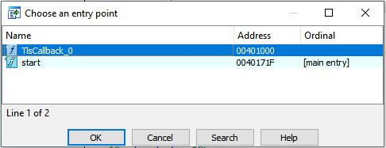
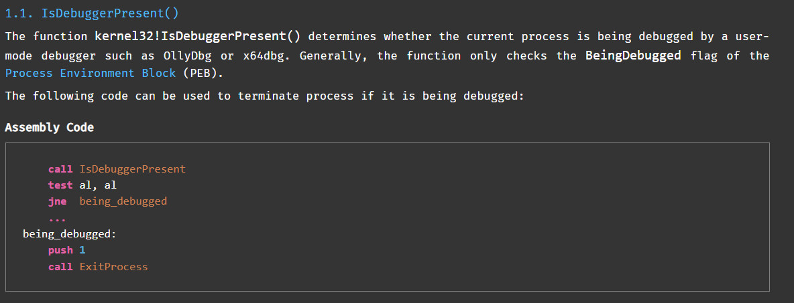
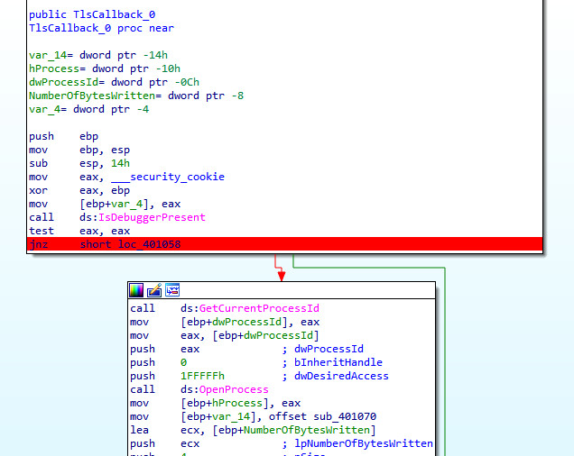

# Analysis with IDA
## TLSCallback
Đầu tiên, đề bài gợi ý bài này tìm hiểu về TLS Callback nên mình sẽ ném file vào ida

Hiểu đơn giản thì TLS callback sẽ được thực hiện trước main entry point của chương trình xem chương trình có đang bị debug hay không. 

--> Để bypass qua kỹ thuật này và tiến hành debug được chương trình thì mình sẽ xác định xem hàm này ở đâu bằng cách bấm tổ hợp phím Ctrl + E



Ở đây, xuất hiện cơ chế antidebug ```IsDebuggerPresent```



--> Trước hết mình đặt bp và nhấn F9 để run



--> Để bypass qua kỹ thuật này mình thực hiện patch file bằng cách đổi ```jnz``` thành ```jz```
--> Set bp run tới hàm Main
## Main
Tại đây chương trình yêu cầu nhập input, tính toán và check với key

Mình đã sửa lại tên cho dễ nhìn

#### Main
```
int __cdecl main(int argc, const char **argv, const char **envp)
{
  FILE *v3; // eax
  int v4; // ecx
  char v6; // [esp+0h] [ebp-30h]
  int j; // [esp+0h] [ebp-30h]
  unsigned int i; // [esp+8h] [ebp-28h]
  char *key2; // [esp+Ch] [ebp-24h]
  signed int v10; // [esp+10h] [ebp-20h]
  char *input; // [esp+14h] [ebp-1Ch]
  char key1[20]; // [esp+18h] [ebp-18h] BYREF

  strcpy(key1, "VdlKe9upfBFkkO0L");
  key2 = (char *)malloc(0x100u);
  input = (char *)malloc(0x100u);
  memset(input, 0, 0x100u);
  memset(key2, 0, 0x100u);
  memcpy(key2, &::key2, 48u);
  sub_401410("FLAG : ", v6);
  v3 = _acrt_iob_func(0);
  fgets(input, 256, v3);
  v10 = strlen(input);
  v4 = v10 % 8;
  if ( v10 % 8 )
  {
    for ( i = 0; i < 8 - v4; ++i )
      input[v10 - 1 + i] = 10;
    v10 += 8 - v4;
  }
  for ( j = 0; j < v10 / 8; ++j )
  {
    sub_401070((unsigned int *)input, key1);
    if ( memcmp(input, key2, 8u) )
    {
      puts("Incorrect");
      exit(0);
    }
    input += 8;
    key2 += 8;
  }
  puts("Correct");
  return 1;
}
```

#### Hàm sub_401070
```
int __fastcall sub_401070(unsigned int *input, _DWORD *key1)
{
  int result; // eax
  unsigned int i; // [esp+14h] [ebp-18h]
  int v4; // [esp+1Ch] [ebp-10h]
  unsigned int v5; // [esp+24h] [ebp-8h]
  unsigned int v6; // [esp+28h] [ebp-4h]

  v6 = *input;
  v5 = input[1];
  v4 = 0;
  for ( i = 0; i < 32; ++i )
  {
    v4 -= 0x61C88647;
    v6 += (key1[1] + (v5 >> 5)) ^ (v4 + v5) ^ (*key1 + 16 * v5);
    v5 += (key1[3] + (v6 >> 5)) ^ (v4 + v6) ^ (key1[2] + 16 * v6);
  }
  *input = v6;
  result = 4;
  input[1] = v5;
  return result;
}
```
--> Google ```0x61C88647```, mình phát hiện chương trình sử dụng thuật toán XTEA để encrypt input nhập vào với key1 (số "num_round" là 32). Sau đó tiến hành check với key2

--> Có được ciphertext chính là key2

--> Dựa vào code decrypt trên mạng, tiến hành sửa lại key, matrix, hai vòng Feistel-cipher truyền vào và tìm được input
## Script
Link: https://github.com/p4-team/ctf/blob/master/2016-03-06-bkpctf/re_4_unholy/decrypt.cpp
```
#include <stdio.h>
#include <stdint.h>
// http://tpforums.org/forum/threads/2158-XTEA-Encryption-Decryption-Code/page4
void process_decrypt(uint32_t *v, uint32_t *k){
	uint32_t v0 = v[0],	v1 = v[1], i, 
		delta = 0x61C88647,
		sum = 0xC6EF3720;
	for(i = 0; i < 32; i++){   
		v1 -= (k[3] + (v0 >> 5)) ^ (sum + v0) ^ (k[2] + 16 * v0);
		v0 -= (k[1] + (v1 >> 5)) ^ (sum + v1) ^ (*k + 16 * v1);
		sum += delta;
		
	}
	v[0] = v0;
	v[1] = v1;
}

void print(uint32_t x){
	printf("%c%c%c%c", x&0xFF, (x&0xFF00)>>8,
			(x&0xFF0000)>>16, (x&0xFF000000)>>24);
}

int main(){
	uint32_t key[]={0x4B6C6456,0x70753965 ,0x6B464266 ,0x4C304F6B};
	for(int i=0;i<4;i++){
		print(key[i]);
	}
	printf("\n");
	uint32_t matrix[]={707800089, 39123321, 3597445555, 76906641, 2749913385, 2260564239, 1813185967, 735802878, 1576067246, 2307279752, 1168926259, 2792909978};
	for(int i=0;i<6;i++){
		process_decrypt(matrix+2*i, key);
	}
	for(int i=0;i<12;i++){
		print(matrix[i]);
	}
}
```
```
flag: PTITCTF{bdc90e23aa0415e94d0ac46a938efcf3}
```
