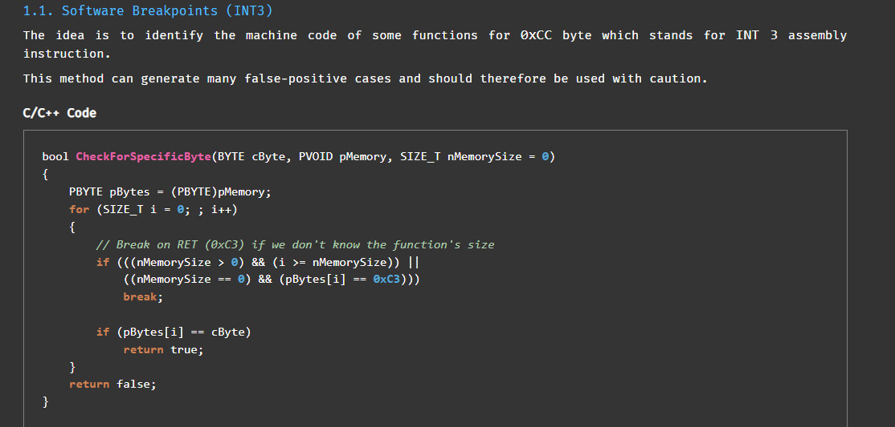
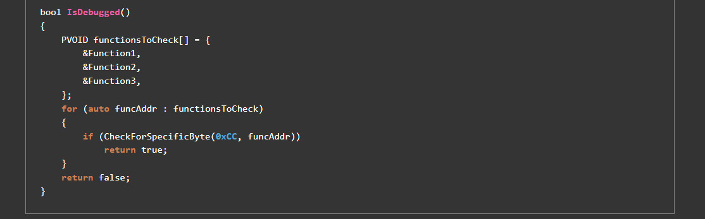

# Analysis with IDA
Theo như gợi ý từ đề, bài này sử dụng các kỹ thuật Software BreakPoint trong Antidebug

Mình ném file vào IDA

## Hàm main
```
int __cdecl main(int argc, const char **argv, const char **envp)
{
  FILE *v3; // eax
  int v4; // eax
  int i; // [esp+0h] [ebp-3Ch]
  unsigned int v7; // [esp+4h] [ebp-38h] BYREF
  char Buffer[16]; // [esp+8h] [ebp-34h] BYREF
  int v9[3]; // [esp+18h] [ebp-24h] BYREF
  __int16 v10; // [esp+24h] [ebp-18h]
  char v11[16]; // [esp+28h] [ebp-14h] BYREF

  puts("Enter Flag :");
  v3 = _acrt_iob_func(0);
  fgets(Buffer, 14, v3);
  qmemcpy(v11, "}\b", 2);
  v11[2] = -19;
  v11[3] = 71;
  v11[4] = -27;
  v11[5] = 0;
  v11[6] = -120;
  v11[7] = 58;
  v11[8] = 122;
  v11[9] = 54;
  v11[10] = 2;
  v11[11] = 41;
  v11[12] = -28;
  v11[13] = 0;
  memset(v9, 0, sizeof(v9));
  v10 = 0;
  v4 = sub_E51080((unsigned __int8 *)main);
  v7 = sub_E510C0(main, v4) ^ 0xDEADBEEF;
  sub_E51120(Buffer, 13, &v7, 4, v9);
  for ( i = 0; i < 13; ++i )
  {
    if ( v11[i] != *((_BYTE *)v9 + i) )
    {
      printf("Failed", i);
      return 1;
    }
  }
  printf("Success!! Here is your Flag : Flag{%s}", (char)Buffer);
  return 0;
}
```
Chương trình yêu cầu nhập input, tiến hành tính toán và check input với v11

Tại đây mình thấy 2 hàm rất lạ ```sub_E51080``` và ```sub_E510C0```
### Hàm sub_E51080
```
int __cdecl sub_E51080(unsigned __int8 *a1)
{
  int v2; // [esp+0h] [ebp-Ch]
  int v3; // [esp+4h] [ebp-8h]

  v3 = 0;
  do
  {
    ++v3;
    v2 = *a1++;
  }
  while ( v2 != 0xC3 );
  return v3;
}
```
### Hàm sub_E510C0
```
int __cdecl sub_E510C0(int a1, unsigned int a2)
{
  unsigned int i; // [esp+4h] [ebp-8h]

  for ( i = 0; i < a2; ++i )
  {
    if ( (*(unsigned __int8 *)(i + a1) ^ 0x55) == 0x99 )
      return 0x13;
  }
  return 0x37;
}
```
Đọc tài liệu về Software BreakPoint





--> Mình xác định được hàm ```sub_E51080``` sẽ dựa vào RET (0xC3) để tính toán và return size của hàm main

--> Hàm sub_E510C0 với 2 tham số truyền vào là địa chỉ hàm main và kích thước hàm main thì sẽ check các byte bắt đầu từ địa chỉ hàm main với 0xCC (0x99 ^ 0x55 = 0xCC)

--> Nếu bằng thì return giá trị 0x13 và ngược lại return 0x37

Đây là kỹ thuật int 3. Câu lệnh int 3 lệnh này là lệnh ngắt để dừng chương trình lại tại điểm các bạn muốn. Tức là khi mình sử dụng trình debugger, 
mỗi khi mình set breakpoint thì opcode 0xCC sẽ được set tại vị trí đó.

=> Vậy để chống chúng ta debug được thì tác giả sẽ tạo hàm để kiểm tra chương trình của chúng ta có chỗ nào đó opcode đã bị biến đổi thành 0xCC hay không, 
bằng hàm sub_E510C0

=> Để bypass qua kỹ thuật này ta set 0x13 thành 0x37

=> ```v7 = 0x37^0xDEADBEEF = 0xdeadbed8```

### Hàm sub_E51120
```
int __cdecl sub_E51120(int input, int a2, _DWORD *a3, int a4, int a5)
{
  int v5; // eax
  int result; // eax
  char v7[512]; // [esp+0h] [ebp-21Ch]
  int v8; // [esp+200h] [ebp-1Ch]
  int k; // [esp+204h] [ebp-18h]
  int v10; // [esp+208h] [ebp-14h]
  int j; // [esp+20Ch] [ebp-10h]
  int i; // [esp+210h] [ebp-Ch]
  int v13; // [esp+214h] [ebp-8h]
  char v14; // [esp+21Bh] [ebp-1h]

  v13 = 0;
  v8 = 0;
  v10 = 0;
  v5 = sub_E51080((unsigned __int8 *)sub_E51120);
  result = *a3 + sub_E510C0((int)sub_E51120, v5);
  *a3 = result;
  for ( i = 0; i < 256; ++i )
  {
    v7[i + 256] = i;
    v7[i] = *((_BYTE *)a3 + i % a4);  //a4 = 4
    result = i + 1;
  }
  for ( j = 0; j < 256; ++j )
  {
    v13 = ((unsigned __int8)v7[j] + v13 + (unsigned __int8)v7[j + 256]) % 256;
    v14 = v7[v13 + 256];
    v7[v13 + 256] = v7[j + 256];
    v7[j + 256] = v14;
    result = j + 1;
  }
  v13 = 0;
  for ( k = 0; k < a2; ++k )  //a2 = 13
  {
    v10 = (v10 + 1) % 256;
    v13 = (v13 + (unsigned __int8)v7[v10 + 256]) % 256;
    v14 = v7[v13 + 256];
    v7[v13 + 256] = v7[v10 + 256];
    v7[v10 + 256] = v14;
    v8 = ((unsigned __int8)v7[v13 + 256] + (unsigned __int8)v7[v10 + 256]) % 256;
    *(_BYTE *)(k + a5) = v7[v8 + 256] ^ *(_BYTE *)(k + input);  //a5 = v9
    result = k + 1;
  }
  return result;
}
```
Tại đây ta lại thấy xuất hiện 2 hàm đặc biệt
```
v5 = sub_E51080((unsigned __int8 *)sub_E51120);
result = *a3 + sub_E510C0((int)sub_E51120, v5); //a3 = v7
```
Phân tích tương tự như trên, ta được hàm sub_E510C0 trả về giá trị 0x37

--> Khi đó ```result = v7 + 0x37 = 0xdeadbed8 + 0x37 = 0xdeadbf0f```

--> Sau khi tính toán sẽ xor lưu giá trị vào v9. Cuối cùng check từng ký tự của v9 với v11
### Script 
```
key = [125,8,237,71,229,0,136,58,122,54,2,41,228,0]
a3 = [0x0F, 0xBF, 0xAD, 0xDE] 
v7 = [0]*512
input = []
for i in range(0,256):
    v7[i + 256] = i
    v7[i] = a3[i % 4]
    result = i + 1
 
v13 = 0
for j in range(0,256):
    v13 = (v7[j] + v13 + v7[j+256])%256
    v14 = v7[v13 + 256]
    v7[v13 + 256] = v7[j + 256]
    v7[j + 256] = v14
    result = j + 1
   
v13 = 0
v10 = 0
for k in range(0,13):
    v10 = (v10 + 1)%256
    v13 = (v13 + v7[v10 + 256]) % 256
    v14 = v7[v13 + 256]
    v7[v13 + 256] = v7[v10 + 256]
    v7[v10 + 256] = v14
    v8 = (v7[v13 + 256] + v7[v10 + 256]) % 256
    input.append(v7[v8 + 256] ^ key[k])
    
for i in input:
    print(chr(i), end ="")    
```

